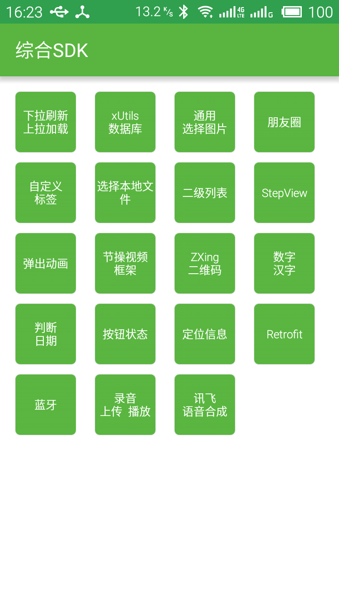

# MemoDemo
由于工作需要,将经常使用的代码整合成一个较大的demo,长期更新...

###目前实现:

· 下拉刷新 上拉加载更多

· 使用xUtils3数据库功能

· choose-media模块暂不开放

· 二级列表 和 三级联动选择城市

· StepView步骤指示器

· 使用multi-imges-select 选择本地图片  多少自己定

· 加入弹出模块 包括PopupWindow(仿微信)和Activity的弹出动画

· 添加使用节操视频框架播放视频

· 添加ZXing使用案例 包括扫描和生成二维码

· 添加数字日期转为汉字日期的功能

· 添加判断日期为今天或者其他日期的模块

· 添加了为View设置了Ripple效果的demo(在朋友圈模块 (-__-)b)

· 更改按钮的状态,并判断在何状态下才可点击

· 加入高德地图 显示给定的周边定位信息

· 加入蓝牙模块 连接SP1201热敏打印机进行三联运单打印操作 此打印机基于CPCL指令集  至此蓝牙打印开发告一段落 T_T

· 加入录音并上传到七牛云并下载播放

###主页:
</img>
